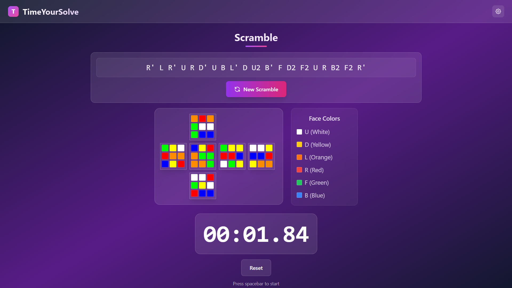

# TimeYourSolve 🎯

A modern, professional Rubik's cube timer application built with React and Vite. Perfect for speedcubers who want to practice with generated scrambles and track their solve times.



## ✨ Features

- **Precision Timer**: High-accuracy timer with millisecond precision
- **Spacebar Control**: Start/stop timer with spacebar for quick access
- **Scramble Generator**: Generate random 20-move scrambles for practice
- **3D Cube Visualizer**: Visual representation of the scrambled cube state
- **Modern UI**: Beautiful gradient design with smooth animations
- **Responsive Design**: Works perfectly on desktop and mobile devices
- **Real-time Updates**: Live timer display with visual feedback

## 🚀 Getting Started

### Prerequisites

- Node.js (version 16 or higher)
- npm or yarn package manager

### Installation

1. Clone the repository:
```bash
git clone https://github.com/yourusername/timeyoursolve.git
cd timeyoursolve
```

2. Install dependencies:
```bash
npm install
```

3. Start the development server:
```bash
npm run dev
```

4. Open your browser and navigate to `http://localhost:5173`

### Building for Production

To create a production build:

```bash
npm run build
```

To preview the production build:

```bash
npm run preview
```

## 🎮 How to Use

### Timer Controls
- **Start Timer**: Press the spacebar
- **Stop Timer**: Press the spacebar again
- **Reset Timer**: Click the "Reset" button
- **Visual Feedback**: Timer background changes color when running

### Scramble Features
- **Generate New Scramble**: Click the "New Scramble" button
- **Scramble Display**: View the current scramble notation
- **Cube Visualization**: See a 3D representation of the scrambled cube

### Keyboard Shortcuts
- `Spacebar`: Start/Stop timer
- The timer automatically prevents spacebar from scrolling the page

## 🛠️ Tech Stack

- **Frontend Framework**: React 19
- **Build Tool**: Vite
- **Styling**: Tailwind CSS
- **Cube Visualization**: Custom 3D renderer
- **State Management**: React Hooks
- **Linting**: ESLint

## 📁 Project Structure

```
timeyoursolve/
├── public/
│   ├── tys.png          # App screenshot
│   └── vite.svg         # Vite logo
├── src/
│   ├── components/
│   │   ├── Timer.jsx           # Main timer component
│   │   ├── Scarmble.jsx        # Scramble generator
│   │   ├── CubeVisualizer.jsx  # 3D cube renderer
│   │   └── NavBar.jsx          # Navigation component
│   ├── App.jsx                 # Main app component
│   ├── main.jsx               # App entry point
│   └── index.css              # Global styles
├── package.json
└── README.md
```

## 🎨 Features in Detail

### Timer Component
- Millisecond precision timing
- Spacebar controls for quick access
- Visual feedback with color changes
- Reset functionality
- Responsive design for all screen sizes

### Scramble Generator
- Generates WCA-compliant 20-move scrambles
- Prevents consecutive moves on the same face
- Includes all standard cube notation (U, D, L, R, F, B)
- Supports modifiers (', 2) for different move types

### Cube Visualizer
- Real-time 3D cube state representation
- Applies scramble moves to visual cube
- Color-coded faces following standard cube conventions
- Responsive grid layout

## 🔧 Development

### Available Scripts

- `npm run dev` - Start development server
- `npm run build` - Build for production
- `npm run preview` - Preview production build
- `npm run lint` - Run ESLint

### Contributing

1. Fork the repository
2. Create a feature branch (`git checkout -b feature/amazing-feature`)
3. Commit your changes (`git commit -m 'Add some amazing feature'`)
4. Push to the branch (`git push origin feature/amazing-feature`)
5. Open a Pull Request

## 📝 License

This project is licensed under the MIT License - see the [LICENSE](LICENSE) file for details.

## 🤝 Support

If you have any questions or need help, please open an issue on GitHub or contact the maintainers.

---

**Happy Solving! 🎯**
